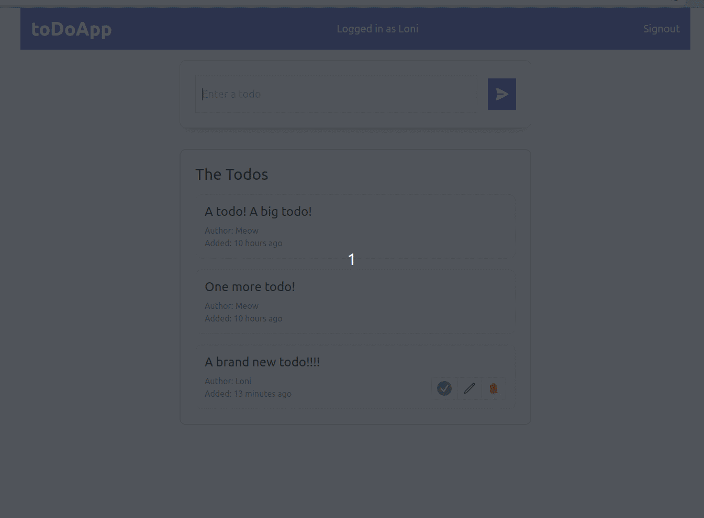

# Todo List



* This is MERN stack based CRUD application.
* Have password based **authentication**
  * Uses **jsonwebtoken** for autherization and session 
  * uses bcrypt js for password encryption
* Build using **Vite** ,**TypeScript** and styled using **Tailwindcss**. 
* have also written some testcases using **Jest**
* Apps work in both online and offline mode.

## Setup

1. Create .env file inside backend like this
   ```
    MONGODB_ATLAS_URL = ''
    TOKEN_KEY = ''
    CLIENT_URL = ""
   ```
2. Write any random string having length between 10-20 in TOKEN_KEY *(used for encryption)*.
3. And mongodb URI https://www.mongodb.com/docs/guides/atlas/connection-string/
4. Create .env.local file in frontend and add backend url
   ```
    VITE_API_URL = ""
   ```
5. Install the dependencies
   ```
   cd backend
   yarn install
   cd ../frontend
   yarn install
   ```

## To run 
* by using concurrently can run both backend and frontend simultaneously with single command

   ```
   cd backend
   yarn run both
   ```
